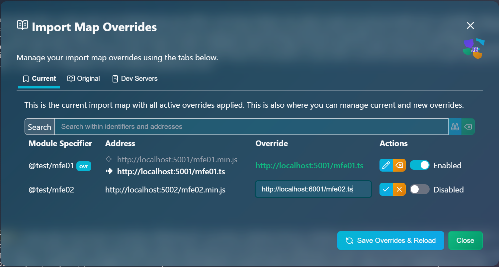

# &nbsp;CollageJS

> Micro library for framework-agnostic micro-frontends

**🚧🚧 YOU'RE EARLY.  WORK IN PROGRESS... ETA: Early February, 2026 🚧🚧**

**If you're interested, star ⭐ the repository to get updates on the progress in your GH homepage.**

*If you would like to express yourself, head to the [Discussions board](https://github.com/collagejs/collagejs/discussions).*

[Full Documentation](https://collagejs.dev)

*CollageJS* is a very, very small library that enables the composition of a web user interface with micro-frontends created with any technology (Svelte, React, Vue, SolidJS, HTMX, etc.).  It is heavily inspired by the *parcel* concept in the excellent `single-spa` routing library.

## How It Works

*CollageJS* defines a contract that must be fulfilled by an object.  This contract is defined by the following TypeScript interface (simplified):

```typescript
type UnmountFn = () => Promise<void>;

interface CorePiece<TProps> {
    mount: (target: HTMLElement, props?: TProps) => Promise<UnmountFn>;
    update?: (props: TProps) => Promise<void>;
};
```
> ℹ️ These types were simplified.  See the real ones after installing the library.

In short:  Micro-frontend creators must simply provide a way to generate an object that fulfills the above `CorePiece` interface, where:

- `mount` mounts the micro-frontend user interface in the document
- `update` updates the properties given to the micro-frontend

The `update` function is optional.  The `mount` function must return a cleanup function that, ideally, reverts the mounting process.

This object, once obtained by the consuming project/micro-frontend, is given to the `<Piece>` component.  The implementation of this component is framework-specific.  For example, the `<Piece>` component found in the `@collagejs/svelte` package is a **Svelte** component.

### Example

This is a simple example that shows a tiny, yet complete micro-frontend made with vanilla TypeScript.  It is used to unit-test the `@collagejs/svelte` NPM package:

```typescript
export function buildTestPiece<TProps extends Record<string, any> = Record<string, any>>(
    callbacks?: {
        mount: (target: HTMLElement, props?: MountProps<TProps>) => void | (() => void);
        unmount: () => void;
        update: (props: TProps) => void;
    }
): CorePiece<TProps> {
    let pre: HTMLElement;
    return {
        // Here's mount():
        async mount(target: HTMLElement, props?: MountProps<TProps>) {
            const delayMountCb = callbacks?.mount?.(target, props);
            pre = document.createElement('pre');
            pre.setAttribute('data-testid', pieceTestId);
            pre.textContent = JSON.stringify(props, null, 2);
            target.appendChild(pre);
            if (delayMountCb) {
                await delay();
                delayMountCb();
            }
            // Here's the unmounting function:
            return () => {
                callbacks?.unmount?.();
                target.removeChild(pre);
                return Promise.resolve();
            };
        },
        // Here's update():
        update(props: TProps) {
            callbacks?.update?.(props);
            pre.textContent = JSON.stringify(props, null, 2);
            return Promise.resolve();
        }
    };
}
```
> *Ignore the callbacks thing.  Those exist for unit-testing purposes only.*

The key learnings here are:

1. We can export functions that create *CollageJS* pieces.  This is the simplest and most flexible approach:  **Factory functions**.
2. Inside `mount()`, we do whatever we need to do to mount our user interface inside the target element.
3. We return a cleanup function that unmounts the user interface.
4. We optionally provide the `update()` method for property reactivity.

You can export from a single project as many of these factory functions as desired.  You are not constrained to expose just one *CollageJS* piece per project.  Export as many as needed/wanted.

This is how packages like `@collagejs/svelte` work:  When mounting, it calls Svelte's `mount()` function with the given options (if any are given), and returns a cleanup function that calls `unmount()` on the component.  Updating properties is as simple as using a reactive object, at which point Svelte itself takes over the reacting part.

## Router Needs

As you may (or may not) know, `single-spa` is a client-side router that defines a contract similar to `CorePiece` above.  *CollageJS*, on the other hand, doesn't provide a router.  Use whichever client-side router you wish in your micro-frontend projects.

### Why No Router

There are 2 reasons:

1. The concept of "micro-frontend" is not tied to routing
2. Maintenance

Yes, it is very handy to mount/dismount MFE's as the location URL changes.  This makes routing a popular choice, but not a mandatory one.  MFE's can come and go for any reason, like button clicks, timers or anything a developer can imagine.

Maintenance is an issue.  The `single-spa` core team has had hard times trying to accommodate everyone's needs, especially when dealing with clashing behavior between their router and some framework's router, because people create MFE's with their own router built-in.  On top of this, `single-spa`'s layout web component, which is a "define your routes in markup" helper, lacks features that people want because they exist in other router engines.

So, the conclusion here is:  *CollageJS* takes care of micro-frontends.  Just that.

### Gimme a Router!

Ok, so you really want routing capabilities.  Understood.

The creator of *CollageJS* has also created an advanced, highly efficient and unique client-side router that:

- Matches multiple routes
- Can simultaneously do path routing and hash fragment routing
- Can support multiple named paths in the hash fragment
- Can render any number of user interface pieces for a single route anywhere in the document
- And many more features...

[webJose's Svelte Router](https://svelte-router.dev) is our recommendation.  Furthermore, we provide a starter GitHub template repository to get you started quickly:  [Template Repository](https://github.com/collagejs/root-template)

You can easily create a new *CollageJS* root project by telling GitHub to create a new repository for you using the above template.  Once you do that, you get a **Vite + Svelte + TS** project configured with the router and fully working.  The project, among other things, teaches:

- How the router can be configured
- How routers and routes are laid out in markup
- How fallback content works

> 🪤**The Catch**:  It is a Svelte project.  Ideally, you should know [Svelte](https://svelte.dev) to take full advantage of it.  With `single-spa`, you would have to learn how it worked, and how its layout web component worked.  With this one, you should learn at least a little Svelte.  Some learning curve on both sides.  The good thing about this one is that Svelte knowledge is much more far-reaching.  Svelte is very easy and fun.  We promise.

## For the `single-spa` Savvy

If you know/are used to `single-spa`, you're almost up to speed with *CollageJS*.  Basically, there's no concept of a "root config" project, but of course, there's always a "root" project.  Use whatever framework/technology you want to produce it.

Then the micro-frontends:  The concept doesn't exist.  At this point (after creating a root UI project), you're 100% free to do as you wish.  Just mount *CollageJS pieces*, which are basically  the equivalent of `single-spa` parcels.  You don't get a router provided, you bring your own, or don't bring a router.  No worries.  Who says that a router is required?  Not us.  You can trigger "parcel" loading by any means at your disposal:  Button clicks, timers, window events, and yes, also location URL changes (routing) if you want.

### Technical Differences

While `single-spa` asks you to shape your module exports in a particular way (the lifecycle functions), *CollageJS* imposes no such restriction.  It is just not necessary.  Just make sure you can get an object of type `CorePiece` to the `<Piece>` component of your preferred framework.  Then use your framework's marvels to make the `<Piece>` component appear or disappear.

Yes, you'll still be working with import maps.  They are super handy.  We provide an enhanced (and simplified at the same time) version of `import-map-overrides` named `@collagejs/imo`.  It only supports the `overridable-importmap` type (and therefore only native import maps for native ES modules), but carries support for our `@collagejs/aim` plug-in that let's you statically import from micro-frontends.  **That's right!  We are free from dynamic `import()` calls!**  We can statically import from micro-frontends.  Furthermore, it has a more modern user interface:



> 🌟 **Fun Fact**:  This user interface is a *CollageJS* piece.

#### Where Did the `unmount` Lifecycle Function Go?

In *CollageJS*, `CorePiece.mount()` returns the clean-up (unmounting) function.

#### And What About `bootstrap`?

Gone.  There's no equivalent in *CollageJS*, as experience with `single-spa` has demonstrated that is rarely needed, and if needed, one can do this initialization easily without having to impose the function requirement.  At least for now, there's no foreseeable future where an initialization function similar to `single-spa`'s `bootstrap()` will be defined.  But we agree:  *Never say NEVER*.

## Packages

| Package | Status | Links | Description |
| - | - | - | - |
| `@collagejs/core` | ✔️ | (This repo) | Core functionality.  Provides the general mounting and unmounting logic. |
| `@collagejs/vite-css` | ✔️ | [Repo](https://github.com/collagejs/vite) | Vite plug-in that offers a CSS-mounting algorithm that is fully compatible with Vite's CSS bundling, including split CSS.  It also features FOUC prevention. |
| `@collagejs/vite-im` | 🚧 | [Repo](https://github.com/collagejs/vite) | **Coming soon**.  Vite plug-in that injects an import map and optionally the `import-map-overrides` package to define bare module identifiers for easy micro-frontend loading and debugging. |
| `@collagejs/vite-aim` | 🚧 | [Repo](https://github.com/collagejs/vite) | **Coming soon**.  Vite-plugin that gives the Vite development server the ability to accept import maps from the client, which are used to resolve modules in the Vite pipeline, enabling static imports from micro-frontend bare module identifiers. |
| `@collagejs/imo` | 🚧 | [Repo](https://github.com/collagejs/imo) | **Coming soon**.  Our version of `import-map-overrides` that does the usual overriding of import map entries, plus it transmits the final import map to Vite development servers found in it. |
| `@collagejs/svelte` | ✔️ | [Repo](https://github.com/collagejs/svelte) | Svelte component library that can be used to create `CorePiece`-compliant objects and to mount `CorePiece` objects (of any technology) by providing the `<Piece>` component. |
| `@collagejs/react` | ❌ | [Repo](https://github.com/collagejs/react) | **Next priority**.  React component library that can be used to create `CorePiece`-compliant objects and to mount `CorePiece` objects (of any technology) by providing the `<Piece>` component. |
| `@collagejs/solidjs` | ❌ | [Repo](https://github.com/collagejs/vite) | SolidJS component library that can be used to create `CorePiece`-compliant objects and to mount `CorePiece` objects (of any technology) by providing the `<Piece>` component. |
| `@collagejs/vue` | ❌ | [Repo](https://github.com/collagejs/vue) | VueJS component library that can be used to create `CorePiece`-compliant objects and to mount `CorePiece` objects (of any technology) by providing the `<Piece>` component. |
| `@collagejs/angular` | ❌ | | **External help needed.**  We don't have expertise in Angular, nor do we want to acquire it.  If you're an Angular developer, please consider contributing. |

## Other Repositories

| Repository | Description |
| - | - |
| [Root Template](https://github.com/collagejs/root-template) | Root template repository that can be used to create new repositories for *CollageJS* root projects, with client-side routing already configured. |
| (-) | Repository of *CollageJS* pieces made in various front-end technologies for your reference and inspiration. |
